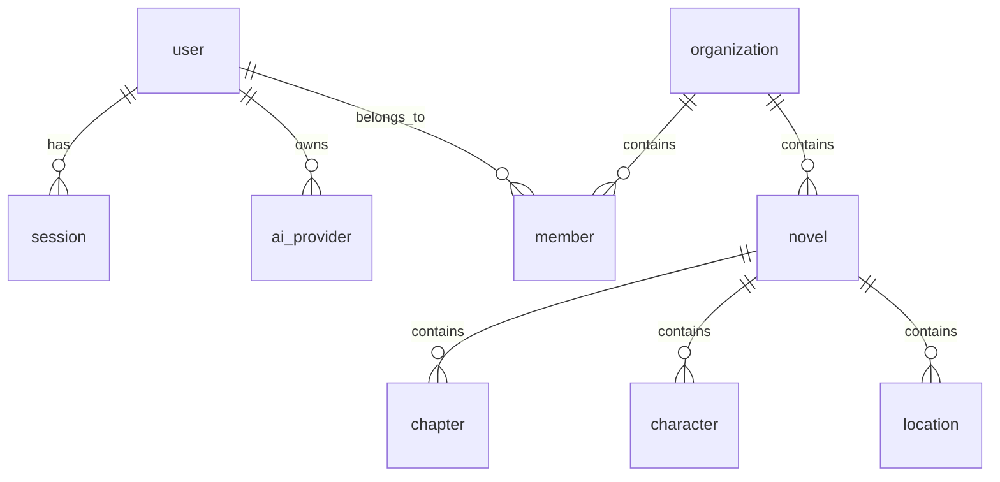

# Database Schema

OpenWrite uses SQLite with Drizzle ORM for type-safe database operations. This document outlines the current schema and relationships.

## Schema Overview

The database is organized into several main areas:

- **Authentication** - User accounts, sessions, OAuth
- **Content** - Novels, chapters, characters, locations
- **Organization** - Teams, members, permissions
- **AI Integration** - Provider connections, usage tracking

## Authentication Tables

### Users (`user`)
Core user account information.

```sql
CREATE TABLE user (
  id TEXT PRIMARY KEY,
  name TEXT NOT NULL,
  email TEXT NOT NULL UNIQUE,
  email_verified BOOLEAN NOT NULL,
  image TEXT,
  created_at TIMESTAMP NOT NULL,
  updated_at TIMESTAMP NOT NULL
);
```

### Sessions (`session`)
User session management for authentication.

```sql
CREATE TABLE session (
  id TEXT PRIMARY KEY,
  expires_at TIMESTAMP NOT NULL,
  token TEXT NOT NULL UNIQUE,
  created_at TIMESTAMP NOT NULL,
  updated_at TIMESTAMP NOT NULL,
  ip_address TEXT,
  user_agent TEXT,
  user_id TEXT NOT NULL REFERENCES user(id),
  active_organization_id TEXT,
  active_team_id TEXT
);
```

## AI Integration Tables

### AI Providers (`ai_provider`)
Stores connections to AI service providers with encrypted credentials.

```sql
CREATE TABLE ai_provider (
  id TEXT PRIMARY KEY,
  user_id TEXT NOT NULL REFERENCES user(id) ON DELETE CASCADE,
  
  -- Provider information
  provider TEXT NOT NULL CHECK (provider IN (
    'openrouter', 'openai', 'anthropic', 'ollama', 
    'groq', 'gemini', 'cohere'
  )),
  provider_user_id TEXT,
  
  -- API key details (encrypted in production)
  api_key TEXT NOT NULL,
  key_hash TEXT,
  key_label TEXT,
  
  -- Configuration
  is_active BOOLEAN NOT NULL DEFAULT true,
  is_default BOOLEAN NOT NULL DEFAULT false,
  
  -- Usage tracking
  usage_limit INTEGER,
  usage_remaining INTEGER,
  current_usage INTEGER DEFAULT 0,
  
  -- Timestamps
  created_at TIMESTAMP NOT NULL,
  updated_at TIMESTAMP NOT NULL,
  last_used_at TIMESTAMP,
  
  -- OAuth fields
  access_token TEXT,
  refresh_token TEXT,
  token_expires_at TIMESTAMP,
  
  -- Provider-specific configuration (JSON)
  supported_models TEXT, -- JSON array
  provider_config TEXT   -- JSON object
);
```

**Key Features:**
- **User-scoped**: Each provider connection belongs to a specific user
- **Multi-provider**: Support for multiple AI service providers
- **OAuth support**: Secure token storage for OAuth providers
- **Usage tracking**: Monitor API usage and enforce limits
- **Encrypted storage**: API keys are encrypted at rest (production)

## Content Tables

### Novels (`novel`)
Primary content container for writing projects.

```sql
CREATE TABLE novel (
  id TEXT PRIMARY KEY,
  title TEXT NOT NULL,
  description TEXT,
  genre TEXT,
  status TEXT NOT NULL DEFAULT 'draft',
  visibility TEXT NOT NULL DEFAULT 'private',
  current_word_count INTEGER DEFAULT 0,
  target_word_count INTEGER,
  cover_image TEXT,
  owner_id TEXT NOT NULL REFERENCES user(id),
  organization_id TEXT NOT NULL REFERENCES organization(id),
  created_at TIMESTAMP NOT NULL,
  updated_at TIMESTAMP NOT NULL,
  last_written_at TIMESTAMP
);
```

### Chapters (`chapter`)
Individual chapters within novels.

```sql
CREATE TABLE chapter (
  id TEXT PRIMARY KEY,
  novel_id TEXT NOT NULL REFERENCES novel(id) ON DELETE CASCADE,
  title TEXT NOT NULL,
  content TEXT DEFAULT '',
  word_count INTEGER DEFAULT 0,
  chapter_number INTEGER NOT NULL,
  status TEXT NOT NULL DEFAULT 'draft',
  created_at TIMESTAMP NOT NULL,
  updated_at TIMESTAMP NOT NULL,
  last_written_at TIMESTAMP
);
```

## Organization Tables

### Organizations (`organization`)
Team workspaces for collaborative writing.

```sql
CREATE TABLE organization (
  id TEXT PRIMARY KEY,
  name TEXT NOT NULL,
  slug TEXT NOT NULL UNIQUE,
  created_at TIMESTAMP NOT NULL,
  updated_at TIMESTAMP NOT NULL,
  icon TEXT
);
```

### Members (`member`)
User membership in organizations.

```sql
CREATE TABLE member (
  id TEXT PRIMARY KEY,
  user_id TEXT NOT NULL REFERENCES user(id),
  organization_id TEXT NOT NULL REFERENCES organization(id),
  role TEXT NOT NULL DEFAULT 'member',
  created_at TIMESTAMP NOT NULL
);
```

## Database Migrations

Migrations are managed through Drizzle Kit and stored in `src/db/migrations/`.

### Running Migrations

```bash
# Generate migration files
bun db:generate

# Apply migrations to development database
bun db:push

# Apply migrations to production
bun db:migrate
```

### Recent Migrations

- **0003_early_silver_surfer.sql** - Added AI providers table with OAuth support
- **0002_lame_ben_parker.sql** - Organization and team management
- **0001_bouncy_sally_floyd.sql** - Core content tables (novels, chapters)
- **0000_faulty_tag.sql** - Initial authentication tables

## Schema Relationships



## Best Practices

### Data Types
- Use `TEXT` for IDs (UUIDs)
- Use `TIMESTAMP` for date/time fields
- Use `BOOLEAN` for flags (stored as INTEGER in SQLite)
- Use `JSON` columns for flexible configuration data

### Security
- **Foreign Key Constraints**: Enforce referential integrity
- **Cascade Deletes**: Properly handle related data cleanup
- **Encryption**: Sensitive data like API keys must be encrypted
- **User Isolation**: All user data is properly scoped

### Performance
- **Indexes**: Add indexes for frequently queried columns
- **Pagination**: Use LIMIT/OFFSET for large result sets
- **Connection Pooling**: Reuse database connections
- **Query Optimization**: Use EXPLAIN to analyze query plans

---

For more detailed information about specific tables or relationships, see the [Architecture Guide](./architecture.md).